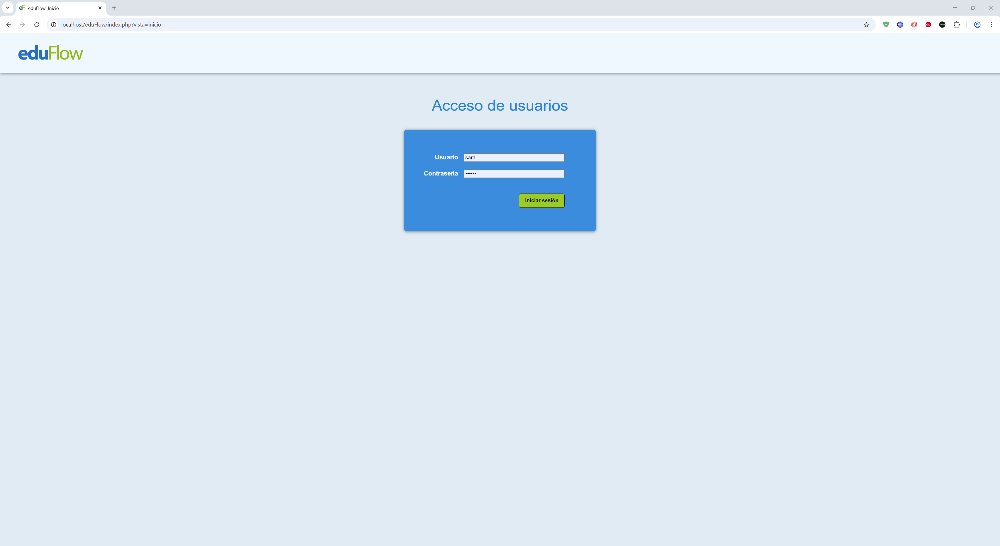
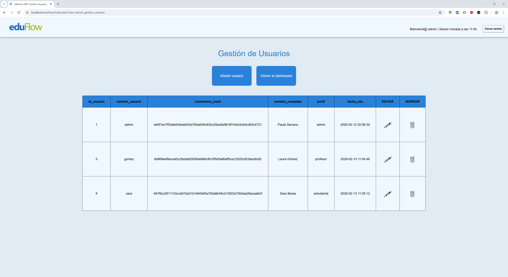
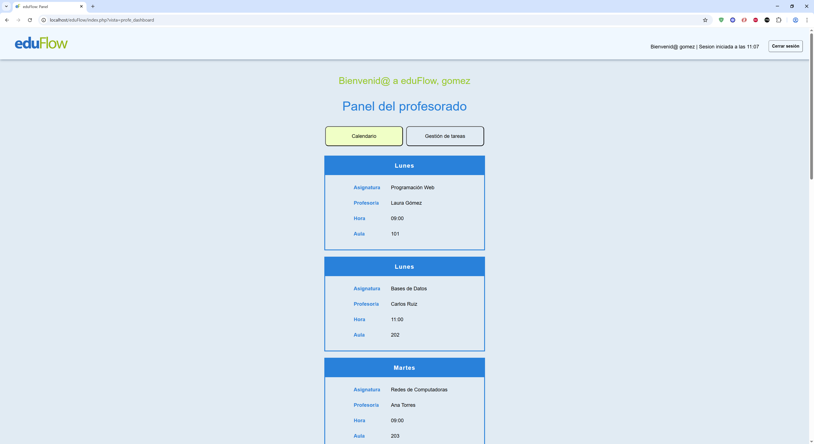
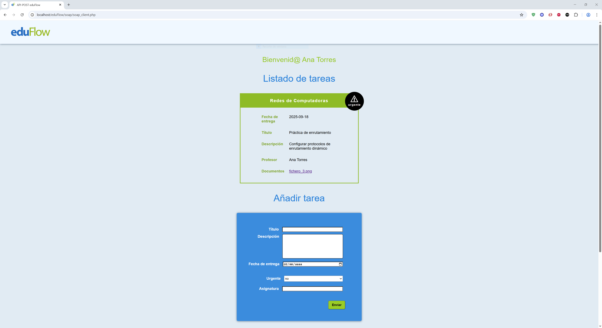

  

# ES: GESTOR PORTAL EDUCATIVO

## Descripción
Proyecto estudiantil que consistió en desarrollar una aplicación web prototipo para gestión básica de una institución educativa con roles de administrador, alumnos y profesores. Posteriormente se añadió un servicio REST y POST.

El proyecto cumple todas las características requeridas para las entregas prácticas de la asignatura a la que corresponde, no obstante, el resultado no es todavía un producto completo y requeriría ampliar y mejorar funcionalidades de forma extracurricular.

## Tecnologías utilizadas
- HTML5
- CSS
- JavaScript
- PHP
- MySQL
- REST
- SOAP
- XAMPP
- Visual Studio Code

## Cómo ejecutar
1. Inicializar Apache y MySQL en XAMPP
2. Identificar el fichero 'eduflow.sql' y copiar su contenido.
3. Entrar desde el navegador a 'localhost/phpmyadmin' e insertar el script MySQL copiado
4. Copiar la carpeta del proyecto en htdocs, renombrarla a 'eduflow'
5. Entrar en 'localhost/eduflow' desde el navegador
6. Usar las credenciales 'admin' y 'abcdef' para entrar por primera vez y crear nuevos usuarios

## Funcionalidades
- Roles de usuario diferenciados (administrador, estudiante, profesor) con diferentes dashboards y opciones según el rol
- Sistema de login conectado a una base de datos para verificar usuario y contraseña
- Mensajes de error en credenciales y mensajes de bienvenida personalizados
- Cierre de sesión si hay inactividad prolongada
- Formularios con opción de retroceder
- Cifrado de contraseñas con algoritmo hash sha256
- Panel de administrador para la gestión CRUD de la tabla usuarios desde la interfaz web
- Información de horarios para profesores y estudiantes a partir de un fichero XML
- Tareas de estudiantes extraídas a partir de un XML con botón que escribe en la base de datos
- Tareas recibidas por el profesor extraídas a partir de la base de datos
- API REST en 'localhost/eduflow/rest/rest_client.php' que permite buscar materias por nombre completo del profesor
- API SOAP en 'localhost/eduflow/soap/soap_client.php' que permite algunas funciones CRUD para la gestión de tareas en el fichero XML

## Estado del proyecto
El proyecto sigue las directrices y acceso a la información indicados por los enunciados de la actividad. De modificarse para obtener un proyecto más completo comenzaríamos tratando los siguientes puntos:

- Eliminar el fichero XML y trabajar la información contenida desde la base de datos
- Revisar la base de datos y añadir tablas y nuevas columnas según necesidades (ej: tabla de asignaturas/horario, columna para tarea entregada, etc.)
- Implementar gestión del calendario y gestión de tareas en el panel de administrador
- Diferenciar en el dashboard de estudiante la agenda de las tareas como en el dashboard del profesor
- Diferenciar para los estudiantes si una tarea ya ha sido entregada o no
- Permitir a los estudiantes subir archivos a las entregas
- Permitir modificar una tarea o archivo como estudiante si aún no es la fecha límite
- Impedir modificar una entrega como estudiante si ha pasado la fecha límite
- Poder visualizar los comentarios del profesor en la tarea desde el perfil de estudiante
- Añadir acceso al servicio SOAP desde el dashboard del profesor para que pueda fácilmente gestionar el CRUD de sus tareas
- Impedir que una tarea ya comentada/corregida por el profesor sea modificada si pasa más de cierto tiempo

Estas serían algunas de las implementaciones que se observan necesarias. Una vez se cumplan estos puntos, podría ser interesante plantear modificaciones de la base de datos que permitan posteriormente implementar que cada alumno pueda estar matriculado de unas materias pero no de otras, que sólo muestre las materias de las que esté matriculado en el dashboard o un sistema que identifique y diferencia inequívocamente a alumnos y profesores incluso si tienen el mismo nombre y apellido.

## Autor
- staluap / Paula Serrano Torrecillas
- Estudiante FP DAW

  

# EN: EDUCATIONAL PORTAL MANAGER

## Description
Student project consisting of developing a prototype web application for basic management of an educational institution with administrator, student, and teacher roles. A REST and POST service was later added.

The project meets all the requirements for the practical assignments of the subject, however, the result is not yet a complete product and would require extending and improving functionalities as extracurricular work.

## Technologies used
- HTML5
- CSS
- JavaScript
- PHP
- MySQL
- REST
- SOAP
- XAMPP
- Visual Studio Code

## How to run
1. Start Apache and MySQL in XAMPP.
2. Locate the 'eduflow.sql' file and copy its contents.
3. Open 'localhost/phpmyadmin' in a browser and paste the MySQL script.
4. Copy the project folder into 'htdocs' and rename it to 'eduflow'.
5. Open 'localhost/eduflow' in the browser.
6. Use the credentials 'admin' and 'abcdef' to log in for the first time and create new users.

## Features
- Differentiated user roles (administrator, student, teacher) with different dashboards and options depending on the role
- Login system connected to a database to verify username and password
- Credential error messages and personalized welcome messages
- Automatic logout after prolonged inactivity
- Forms with a back option
- Password encryption using SHA-256 hashing
- Administrator panel for CRUD management of the users table through the web interface
- Schedule information for teachers and students loaded from an XML file
- Student assignments loaded from XML with a button that writes data to the database
- Assignments received by teachers loaded from the database
- REST API at 'localhost/eduflow/rest/rest_client.php' to search subjects by the teacher’s full name
- SOAP API at 'localhost/eduflow/soap/soap_client.php' providing some CRUD functions to manage assignments in the XML file

## Project Status
The project follows the guidelines and access to information specified in the assignment instructions. To evolve it into a more complete project, the following points would be addressed:
- Remove the XML file and store all information in the database
- Review the database and add tables and new columns as needed (e.g., subjects/schedule table, submitted assignment column, etc.)
- Implement calendar and task management in the administrator panel
- Differentiate the student dashboard task agenda similar to the teacher dashboard
- Show whether a task has already been submitted by the student
- Allow students to upload files for submissions
- Allow students to modify a task or file before the deadline
- Prevent students from modifying a submission after the deadline
- Allow students to view teacher comments on assignments
- Add access to the SOAP service from the teacher dashboard for easy CRUD management of tasks
- Prevent tasks that have already been commented or graded from being modified after a certain time

Once these points are implemented, it would be interesting to modify the database to allow each student to be enrolled in some subjects but not others, show only enrolled subjects in the dashboard, and uniquely identify and differentiate students and teachers even if they share the same name and surname.

## Author
- staluap / Paula Serrano Torrecillas
- Associate Degree in Web Application Development Student

